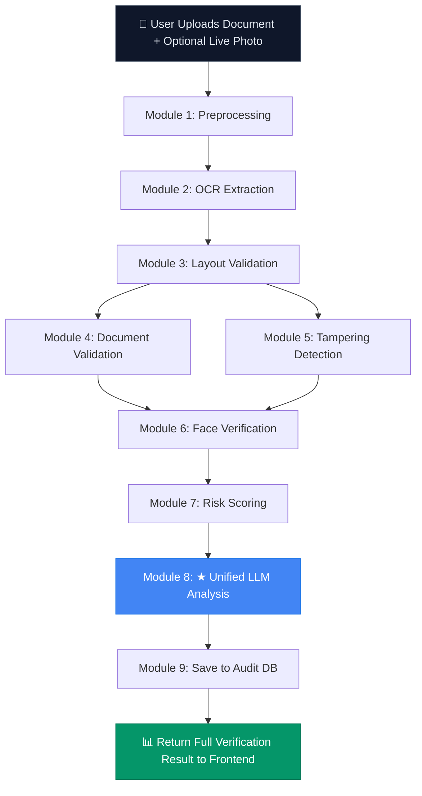

<div align="center">

# 🛡️ SENTINEL AI — Border Identity & Document Screening System

### AI-Powered Real-Time Fake Identity Detection for Border Security

[](https://fastapi.tiangolo.com)
[](https://react.dev)
[](https://python.org)
[](https://ai.google.dev)
[](https://tailwindcss.com)
[](https://sqlite.org)

*A full-stack AI screening platform that processes identity documents through a 9-module security pipeline — OCR extraction, MRZ parsing, layout validation, tampering forensics, face verification, risk scoring, and LLM-powered analysis — to detect forged, altered, or expired documents in real-time.*

</div>

---

## 📋 Table of Contents

- [System Architecture](#-system-architecture)
- [Step-by-Step Pipeline Workflow](#-step-by-step-pipeline-workflow)
- [Tech Stack](#-tech-stack)
- [Project Structure](#-project-structure)
- [Module Deep Dive](#-module-deep-dive)
- [API Reference](#-api-reference)
- [Frontend Pages](#-frontend-pages)
- [Database Schema](#-database-schema)
- [Getting Started](#-getting-started)
- [Running Tests](#-running-tests)
- [Environment Variables](#-environment-variables)

---

## 🏗 System Architecture

```
┌─────────────────────────────────────────────────────────────────┐
│                     SENTINEL AI — FRONTEND                      │
│              React 18 + Vite + TailwindCSS + Axios              │
│                                                                 │
│   ┌──────────────┐   ┌──────────────┐   ┌──────────────────┐   │
│   │  Upload Page  │──▶│  Result Page  │   │  Audit Trail Page│   │
│   │  • Doc Upload │   │  • Risk Badge │   │  • Search/Filter │   │
│   │  • Live Cam   │   │  • Forensics  │   │  • Pagination    │   │
│   │  • Doc Type   │   │  • OCR View   │   │  • Detail Modal  │   │
│   └──────┬───────┘   └──────────────┘   └──────────────────┘   │
│          │ POST /api/documents/verify                            │
└──────────┼──────────────────────────────────────────────────────┘
           │  HTTP (multipart/form-data)
           ▼
┌──────────────────────────────────────────────────────────────────┐
│                     SENTINEL AI — BACKEND                        │
│             FastAPI + Uvicorn + SQLAlchemy + SQLite               │
│                                                                  │
│   ┌────────────────────────────────────────────────────────┐     │
│   │              9-MODULE SCREENING PIPELINE               │     │
│   │                                                        │     │
│   │  1. Preprocessing ──▶ 2. OCR ──▶ 3. Layout ──────┐    │     │
│   │                                                    │    │     │
│   │  4. Validation ◀──────────────────────────────────┘    │     │
│   │       │                                                │     │
│   │       ├──▶ 5. Tampering Detection (concurrent)         │     │
│   │       │                                                │     │
│   │  6. Face Verification ──▶ 7. Risk Scoring              │     │
│   │                               │                        │     │
│   │  8. ★ Unified LLM Call ◀──────┘                        │     │
│   │       │                                                │     │
│   │  9. Audit DB Save                                      │     │
│   └────────────────────────────────────────────────────────┘     │
│                                                                  │
│   ┌─────────────┐  ┌────────────┐  ┌──────────────────────┐     │
│   │  SQLite DB   │  │ risk_model │  │  Gemini AI (1 call)  │     │
│   │  (audit_logs)│  │   (.pkl)   │  │  Field + Explanation │     │
│   └─────────────┘  └────────────┘  └──────────────────────┘     │
└──────────────────────────────────────────────────────────────────┘
```

---

## 🔄 Step-by-Step Pipeline Workflow

The screening pipeline executes **9 sequential modules** for every document. All modules except Module 8 run **locally without any external API calls**.



---

### Module 1 — 🖼️ Image Preprocessing

**File:** `backend/app/modules/preprocessing.py`
**Type:** Local (no API)

| Step | Operation | Details |
|------|-----------|---------|
| 1.1 | File Decode | JPEG / PNG / PDF → PIL Image |
| 1.2 | EXIF Extraction | Camera metadata, software tags, timestamps |
| 1.3 | Auto-Orient | EXIF orientation tag correction |
| 1.4 | Resize | Longest edge capped at 2000px (configurable) |
| 1.5 | Blur Detection | Laplacian variance score (threshold: 100) |
| 1.6 | Brightness Check | Mean intensity — flags dark (<40) or glare (>220) |
| 1.7 | Resolution Check | Warns if shortest edge < 600px |

**Output:** `PreprocessedImage` dataclass with BGR numpy array, quality metrics, and warnings.

---

### Module 2 — 🔍 OCR Text Extraction

**File:** `backend/app/modules/ocr.py`
**Type:** Local (no API)

```
┌───────────────────────────────────────────────────┐
│              OCR Extraction Pipeline               │
│                                                   │
│  Preprocessed Image                               │
│       │                                           │
│       ▼                                           │
│  ┌─────────────────┐   ┌──────────────────────┐  │
│  │  RapidOCR (ONNX) │──▶│ Bounding Box Sorting │  │
│  │  or PaddleOCR    │   │ (top-to-bottom Y)    │  │
│  └─────────────────┘   └──────────┬───────────┘  │
│                                    │              │
│       ┌────────────────────────────┼──────┐       │
│       ▼                            ▼      │       │
│  ┌──────────┐              ┌───────────┐  │       │
│  │ MRZ Parse│              │Regex Field│  │       │
│  │ (ICAO)   │              │ Extraction│  │       │
│  └────┬─────┘              └─────┬─────┘  │       │
│       │                          │        │       │
│       ▼                          ▼        │       │
│  ┌─────────────────────────────────────┐  │       │
│  │     Merged Fields + Checksum        │  │       │
│  │  (Verhoeff, PAN regex, Passport)    │  │       │
│  └─────────────────────────────────────┘  │       │
└───────────────────────────────────────────────────┘
```

| Sub-Module | What It Does |
|------------|-------------|
| **RapidOCR / PaddleOCR** | Extracts text lines with bounding boxes and confidence scores |
| **MRZ Parser** (`mrz.py`) | Detects TD3 (Passport) / TD1 (Visa/ID) MRZ zones, validates ICAO 9303 check digits |
| **Regex Extraction** | Pattern matches: Aadhaar (12-digit), PAN (XXXXX0000X), Passport (X0000000), DL, dates |
| **Verhoeff Checksum** | Validates Aadhaar numbers using Verhoeff algorithm |

---

### Module 3 — 📐 Layout & Geometry Validation

**File:** `backend/app/modules/layout_validator.py`
**Type:** Local (no API)

| Step | Operation | Details |
|------|-----------|---------|
| 3.1 | Perspective Correction | 4-point contour detection + OpenCV warp transform |
| 3.2 | Aspect Ratio Check | ISO/IEC 7810 ID-1 (~1.586) or ICAO Passport (~1.42) |

**Standards enforced:**

| Document Type | Standard | Expected Ratio | Tolerance |
|---------------|----------|-----------------|-----------|
| Aadhaar / PAN / DL | ISO/IEC 7810 ID-1 | ~1.586 | 1.38 – 1.78 |
| Passport / Visa | ICAO 9303 | ~1.42 | 1.25 – 1.65 |
| Other | General | — | 1.20 – 1.85 |

---

### Module 4 — ✅ Rule-Based Document Validation

**File:** `backend/app/modules/validation.py`
**Type:** Local (no API)

7 validation rules are executed against every document:
  
| # | Rule | Description |
|---|------|-------------|
| 1 | `doc_number_present` | Document number field exists |
| 2 | `document_number_pattern` | Number matches expected format for doc type |
| 3 | `id_checksum_valid` | Verhoeff / PAN / Passport checksum passes |
| 4 | `dob_plausible_range` | DOB is in past, age < 120 years |
| 5 | `expiry_date` | Not expired (mandatory for Passport/Visa) |
| 6 | `name_present` | Holder name present (checks `name`, `full_name`, `surname`, `given_names`, `father_name`, `holder_name`, and keyword fallbacks; re-validated post-LLM merge) |
| 7 | `layout_template_valid` | Layout score ≥ 0.50 and aspect ratio OK |

**Additionally:** Document number is checked against a **blacklist database** of known fraudulent IDs.
**Post-LLM Re-Validation:** If local OCR misses the holder name during Module 4, Module 8 (LLM merge) automatically re-checks `name_present`, recalculates `validation_pass_rate` to `1.0`, and re-evaluates `risk_score`.

---

### Module 5 — 🔬 Tampering & Forensics Detection

**File:** `backend/app/modules/tampering.py`
**Type:** Local (no API)

```
┌────────────────────────────────────────────────────────┐
│              TAMPERING DETECTION ENGINE                  │
│                                                        │
│  ┌──────────────┐  ┌───────────────┐  ┌─────────────┐ │
│  │  ELA Analysis │  │ EXIF Metadata │  │   Noise     │ │
│  │  (Error Level │  │  Inspection   │  │Inconsistency│ │
│  │   Analysis)   │  │              │  │  (Grid-Based│ │
│  │              │  │              │  │   Variance)  │ │
│  │  Weight: 45%  │  │  Weight: 35%  │  │  Weight: 20% │ │
│  └──────┬───────┘  └──────┬───────┘  └──────┬──────┘ │
│         │                  │                  │        │
│         └──────────────────┼──────────────────┘        │
│                            ▼                           │
│              ┌──────────────────────┐                  │
│              │  Weighted Tampering  │                  │
│              │   Score (0.0 - 1.0)  │                  │
│              └──────────────────────┘                  │
└────────────────────────────────────────────────────────┘
```

| Signal | Method | Flags When |
|--------|--------|-----------|
| **ELA** | Re-compress JPEG, measure diff intensity | Score > 0.35 |
| **EXIF** | Detect Photoshop/GIMP/Canva signatures, missing timestamps | Score > 0.50 |
| **Noise** | Grid-based σ variance across 4×4 blocks (skimage) | Score > 0.30 |

---

### Module 6 — 👤 Face Verification

**File:** `backend/app/modules/face_match.py`
**Type:** Local (no API)

```
Document Image                    Live Capture
      │                                │
      ▼                                ▼
┌──────────────────┐          ┌──────────────────┐
│ Layout-Based Crop│          │ Face Detection   │
│ (doc type rules) │          │ (Haar Cascade)   │
└────────┬─────────┘          └────────┬─────────┘
         │                             │
         ▼                             ▼
┌──────────────────┐          ┌──────────────────┐
│ Face Detection   │          │ Face Crop        │
│ (Haar Cascade)   │          │ (with margin)    │
└────────┬─────────┘          └────────┬─────────┘
         │                             │
         └──────────┬──────────────────┘
                    ▼
         ┌────────────────────┐
         │   DeepFace Verify  │
         │   (FaceNet model)  │
         │   distance → score │
         └────────────────────┘
```

- **Face Detector:** OpenCV YuNet DNN (`face_detection_yunet_2023mar.onnx`) with Haar Cascade fallback
- **Primary Verifier:** DeepFace with FaceNet embeddings (cosine distance → similarity)
- **Fallback Verifier:** HSV histogram correlation (when DeepFace unavailable)

---

### Module 7 — 📊 ML Risk Scoring

**File:** `backend/app/modules/risk_scoring.py`
**Type:** Local (no API)

A pre-trained **Random Forest Classifier** (`risk_model.pkl`) predicts fraud probability from a **12-feature vector**:

| Feature | Type | Source |
|---------|------|--------|
| `ocr_confidence` | float | OCR engine |
| `validation_pass_rate` | float | Rule engine |
| `id_checksum_valid` | bool | Checksum module |
| `expiry_valid` | bool | Validation rules |
| `tampering_score` | float | Forensics module |
| `face_match_score` | float | Face verification (defaults to `0.93` genuine class mean when live capture omitted) |
| `blacklist_hit` | bool | Blacklist DB |
| `document_type_*` | one-hot | 5 document types |

**Missing Live Capture Handling:**
When no live photo capture is provided, `face_match_score` is set to `0.93` (the genuine class training mean) instead of `0.5`, preventing genuine document-only verification requests from being falsely flagged as fraudulent. A `face_match_missing=True` flag is stored for audit clarity.

**Output:**
- `risk_score`: 0–100 (percentage)
- `prediction`: "genuine" or "fraudulent" (threshold: 0.5)
- `risk_tier`: "low" (< 30) / "medium" (30–70) / "high" (> 70)
- **Hard override:** Blacklist hit → 100% risk, always "fraudulent"

---

### Module 8 — 🤖 Unified LLM Analysis (THE SINGLE AI CALL)

**File:** `backend/app/modules/llm_field_validator.py`
**Type:** External API (Gemini AI — **1 call per document**)

> **This is the ONLY LLM/AI API call in the entire project.**

```
┌────────────────────────────────────────────────────────────────┐
│              SINGLE UNIFIED LLM CALL — Gemini AI               │
│                                                                │
│  INPUT:                                                        │
│  ┌────────────────────────────────────────────────────────┐    │
│  │  • Raw OCR text lines                                  │    │
│  │  • Document type (Passport, Aadhaar, PAN, DL, Visa)    │    │
│  │  • Risk score & prediction from Module 7               │    │
│  │  • Tampering score & flags from Module 5               │    │
│  │  • Face match score from Module 6                      │    │
│  │  • Failed validation rules from Module 4               │    │
│  │  • Blacklist hit status                                │    │
│  │  • Preprocessing warnings                              │    │
│  └────────────────────────────────────────────────────────┘    │
│                          │                                     │
│                          ▼                                     │
│              ┌──────────────────────┐                          │
│              │   Gemini 2.5 Flash   │  (with model fallback    │
│              │   → Gemini 2.0 Flash │   chain & 30s timeout)   │
│              │   → Gemini 1.5 Flash │                          │
│              └──────────┬───────────┘                          │
│                          │                                     │
│  OUTPUT:                 ▼                                     │
│  ┌────────────────────────────────────────────────────────┐    │
│  │  {                                                     │    │
│  │    "extracted_fields": { field → value/confidence },    │    │
│  │    "mismatches_or_anomalies": [ "..." ],               │    │
│  │    "schema_matched": true/false,                       │    │
│  │    "officer_explanation": "One sentence summary"       │    │
│  │  }                                                     │    │
│  └────────────────────────────────────────────────────────┘    │
└────────────────────────────────────────────────────────────────┘
```

LLM-extracted fields are **merged with regex-extracted fields** (regex acts as anchor, LLM refines/fills gaps). If the LLM is unavailable, a **local template engine** generates the explanation instead.

---

### Module 9 — 💾 Audit Trail & Database

**File:** `backend/app/routers/documents.py` + `backend/app/db/schema.py`

Every verification result is saved to **SQLite** (`screening.db`) with full forensic details for audit compliance.

---

## 🛠 Tech Stack

### Backend

| Technology | Purpose |
|------------|---------|
| **FastAPI** | REST API framework with async support |
| **Uvicorn** | ASGI server |
| **SQLAlchemy** | ORM for SQLite database |
| **RapidOCR / PaddleOCR** | Optical Character Recognition engines |
| **OpenCV** | Image processing, perspective warp, ELA |
| **scikit-image** | Noise analysis (sigma estimation) |
| **DeepFace** | Face verification (FaceNet model) |
| **scikit-learn** | Random Forest risk classifier |
| **Google Gemini AI** | LLM field validation & officer explanation |
| **Pillow** | Image decoding & EXIF extraction |

### Frontend

| Technology | Purpose |
|------------|---------|
| **React 18** | UI framework (SPA) |
| **Vite** | Build tool & dev server |
| **TailwindCSS** | Utility-first CSS styling |
| **Axios** | HTTP client for API calls |
| **Lucide React** | Icon library |

---

## 📁 Project Structure

```
SIH/
├── README.md                          ← You are here
│
├── backend/
│   ├── .env                           ← API keys & config
│   ├── requirements.txt               ← Python dependencies
│   ├── screening.db                   ← SQLite audit database
│   │
│   ├── app/
│   │   ├── main.py                    ← FastAPI app entry point
│   │   ├── config.py                  ← Settings & env loader
│   │   │
│   │   ├── routers/
│   │   │   ├── documents.py           ← POST /api/documents/verify (pipeline orchestrator)
│   │   │   └── audit.py               ← GET /api/audit (audit trail endpoints)
│   │   │
│   │   ├── modules/
│   │   │   ├── preprocessing.py       ← Module 1: Image normalization
│   │   │   ├── ocr.py                 ← Module 2: OCR text extraction
│   │   │   ├── mrz.py                 ← Module 2b: MRZ zone parser (ICAO 9303)
│   │   │   ├── layout_validator.py    ← Module 3: Perspective & aspect ratio
│   │   │   ├── validation.py          ← Module 4: Rule-based validation engine
│   │   │   ├── tampering.py           ← Module 5: ELA + EXIF + noise forensics
│   │   │   ├── face_match.py          ← Module 6: DeepFace verification
│   │   │   ├── risk_scoring.py        ← Module 7: Random Forest risk model
│   │   │   ├── llm_field_validator.py ← Module 8: ★ Single Gemini LLM call
│   │   │   └── explain.py             ← Fallback template explanation
│   │   │
│   │   ├── models/
│   │   │   └── risk_model.pkl         ← Pre-trained Random Forest classifier
│   │   │
│   │   ├── db/
│   │   │   ├── database.py            ← SQLAlchemy engine & session
│   │   │   └── schema.py              ← AuditLog ORM model
│   │   │
│   │   └── schemas/
│   │       └── document.py            ← Pydantic response schemas
│   │
│   └── tests/
│       ├── test_preprocessing.py
│       ├── test_ocr.py
│       ├── test_layout.py
│       ├── test_validation.py
│       ├── test_tampering.py
│       ├── test_face_match.py
│       ├── test_risk_scoring.py
│       ├── test_risk_bugs.py          ← Regression tests for scoring bugs
│       ├── test_explain.py
│       └── test_orchestration.py
│
└── Frontend/
    ├── package.json
    ├── vite.config.js
    ├── tailwind.config.js
    │
    └── src/
        ├── main.jsx                   ← React entry point
        ├── App.jsx                    ← Tab-based SPA router
        ├── index.css                  ← TailwindCSS base styles
        │
        ├── pages/
        │   ├── UploadPage.jsx         ← Document upload + camera capture
        │   ├── ResultPage.jsx         ← Verification result dashboard
        │   └── AuditTrailPage.jsx     ← Audit history search & filter
        │
        ├── components/
        │   ├── Navbar.jsx             ← Top navigation bar
        │   ├── DocumentUploader.jsx   ← Drag-and-drop file upload
        │   ├── CameraWidget.jsx       ← Live webcam capture
        │   ├── RiskScoreBadge.jsx     ← Circular risk score gauge
        │   ├── ForensicCard.jsx       ← Tampering analysis display
        │   ├── FieldTable.jsx         ← Extracted fields table
        │   ├── OcrExtractedView.jsx   ← Raw OCR text + LLM analysis
        │   └── ExplanationBanner.jsx  ← Officer explanation banner
        │
        └── services/
            └── api.js                 ← Axios API client
```

---

## 🔌 API Reference

### `POST /api/documents/verify`

Upload a document image for full AI screening.

**Request:** `multipart/form-data`

| Field | Type | Required | Description |
|-------|------|----------|-------------|
| `document_file` | File | ✅ | Document image (JPEG/PNG/PDF, max 10MB) |
| `live_capture_file` | File | ❌ | Live webcam photo for face matching |
| `document_type` | String | ✅ | One of: `Passport`, `Visa`, `Aadhaar`, `PAN Card`, `Driving License`, `Other` |

**Response:** `200 OK` — JSON with full screening result

```json
{
  "id": 42,
  "created_at": "2026-09-13T10:30:00",
  "document_type": "Passport",
  "risk_score": 15,
  "prediction": "genuine",
  "probability": 0.15,
  "explanation": "Verified (15% risk): All document security checks passed.",
  "ocr_confidence": 0.94,
  "validation_pass_rate": 1.0,
  "id_checksum_valid": true,
  "expiry_valid": true,
  "tampering_score": 0.08,
  "face_match_score": 0.92,
  "blacklist_hit": false,
  "extracted_fields": { "document_number": { "value": "A1234567", "confidence": 0.95 } },
  "failed_rules": [],
  "tampering_signals": { "ela_score": 0.05, "metadata_score": 0.1, "noise_inconsistency": 0.02 },
  "llm_validation": { "llm_available": true, "schema_matched": true },
  "layout_score": 0.85,
  "layout_anomalies": []
}
```

### `GET /api/audit`

Paginated audit trail with filtering.

| Query Param | Type | Description |
|-------------|------|-------------|
| `page` | int | Page number (default: 1) |
| `limit` | int | Items per page (default: 20) |
| `document_type` | string | Filter by doc type |
| `risk_tier` | string | Filter: `low`, `medium`, `high` |

### `GET /api/audit/{id}`

Get full details for a specific audit record.

### `GET /api/health`

Health check endpoint.

---

## 🖥 Frontend Pages

| Page | Description |
|------|-------------|
| **Upload Page** | Drag-and-drop document upload with live camera widget for face capture. Select document type from dropdown. |
| **Result Page** | Full verification dashboard: risk score gauge, extracted fields table, forensic analysis card, raw OCR view, and AI explanation banner. |
| **Audit Trail** | Searchable, filterable history of all screenings with pagination. Click any row for full detail modal. |

---

## 🗄 Database Schema

**Table:** `audit_logs`

| Column | Type | Description |
|--------|------|-------------|
| `id` | Integer (PK) | Auto-incrementing ID |
| `created_at` | DateTime | Screening timestamp |
| `document_type` | String(50) | Passport, Aadhaar, etc. |
| `filename` | String(255) | Original filename |
| `risk_score` | Integer | 0–100 risk score |
| `prediction` | String(20) | "genuine" / "fraudulent" |
| `probability` | Float | Raw fraud probability |
| `explanation` | Text | Officer explanation |
| `ocr_confidence` | Float | OCR engine confidence |
| `validation_pass_rate` | Float | % rules passed |
| `id_checksum_valid` | Boolean | Checksum status |
| `expiry_valid` | Boolean | Expiry status |
| `tampering_score` | Float | Combined tampering score |
| `face_match_score` | Float (nullable) | Face similarity |
| `face_match_missing` | Boolean (nullable) | True when live photo capture was omitted |
| `blacklist_hit` | Boolean | Watchlist match |
| `extracted_fields` | JSON | All extracted field data |
| `failed_rules` | JSON | List of failed rule IDs |
| `tampering_signals` | JSON | ELA, EXIF, noise scores |
| `feature_vector` | JSON | 12-feature ML input |
| `raw_text` | JSON | Raw OCR text lines |
| `llm_validation` | JSON | LLM analysis result |
| `layout_score` | Float | Layout compliance score |
| `layout_anomalies` | JSON | Layout issues found |

---

## 🚀 Getting Started

### Prerequisites

- Python 3.12+
- Node.js 18+
- Gemini API Key ([Get one here](https://aistudio.google.com/))

### 1. Clone & Setup Backend

```bash
cd SIH/backend

# Create virtual environment (recommended)
python -m venv venv
venv\Scripts\activate    # Windows
# source venv/bin/activate  # Linux/Mac

# Install dependencies
pip install -r requirements.txt

# Configure environment
cp .env.example .env
# Edit .env and set your GEMINI_API_KEY
```

### 2. Start Backend Server

```bash
cd SIH/backend
uvicorn app.main:app --reload
```

Backend runs at: **http://localhost:8000**

### 3. Setup & Start Frontend

```bash
cd SIH/Frontend

# Install dependencies
npm install

# Start dev server
npm run dev
```

Frontend runs at: **http://localhost:5173**

---

## 🧪 Running Tests

```bash
cd SIH/backend
python -m pytest tests/ -v
```

**Test & Benchmark Coverage:** 40 tests across 11 test files + automated benchmark evaluation suite (`python tests/benchmark_accuracy.py`).

| Test File | Modules Covered |
|-----------|----------------|
| `test_preprocessing.py` | Image decode, resize, blur detection |
| `test_ocr.py` | MRZ parsing, Verhoeff, PAN regex, OCR extraction |
| `test_layout.py` | Aspect ratio, perspective warp, layout validation |
| `test_validation.py` | Date parsing, rule engine, blacklist |
| `test_tampering.py` | ELA, EXIF metadata, tampering score |
| `test_face_match.py` | Face detection (YuNet & Haar fallback), blank image handling |
| `test_risk_scoring.py` | Feature vector, model prediction, self-test |
| `test_risk_bugs.py` | Neutral defaults, name key variants, OCR name extraction, post-LLM revalidation |
| `test_upgrade_tasks.py` | YuNet face detection, messaging app EXIF, resolution-adaptive ELA |
| `test_explain.py` | Template explanation (genuine/fraudulent) |
| `test_orchestration.py` | End-to-end pipeline, audit trail API |
| `benchmark_accuracy.py` | Benchmark evaluation suite (Precision, Recall, F1, ROC-AUC, Confusion Matrix) |

---

## ⚙️ Environment Variables

| Variable | Required | Description |
|----------|----------|-------------|
| `GEMINI_API_KEY` | ✅ | Google Gemini AI API key |
| `DATABASE_URL` | ❌ | SQLite URL (default: `sqlite:///screening.db`) |
| `UPLOAD_DIR` | ❌ | Upload directory (default: `uploads`) |
| `MAX_IMAGE_EDGE` | ❌ | Max image dimension in px (default: `2000`) |
| `RISK_MODEL_PATH` | ❌ | Path to risk_model.pkl (default: `app/models/risk_model.pkl`) |

---

## 📜 Supported Document Types

| Document | ID Format | Checksum | MRZ Support |
|----------|-----------|----------|-------------|
| 🛂 Passport | 1 letter + 7 digits | ICAO 9303 check digits | ✅ TD3 (2-line, 44-char) |
| 🎫 Visa | Variable | ICAO 9303 check digits | ✅ TD1 (3-line, 30-char) |
| 🆔 Aadhaar | 12 digits | Verhoeff algorithm | ❌ |
| 💳 PAN Card | XXXXX0000X | Pattern validation | ❌ |
| 🚗 Driving License | State code + numbers | Length validation | ❌ |

---

<div align="center">

**Built for Smart India Hackathon (SIH)**

*SENTINEL AI — Protecting borders through intelligent document screening*

</div>
