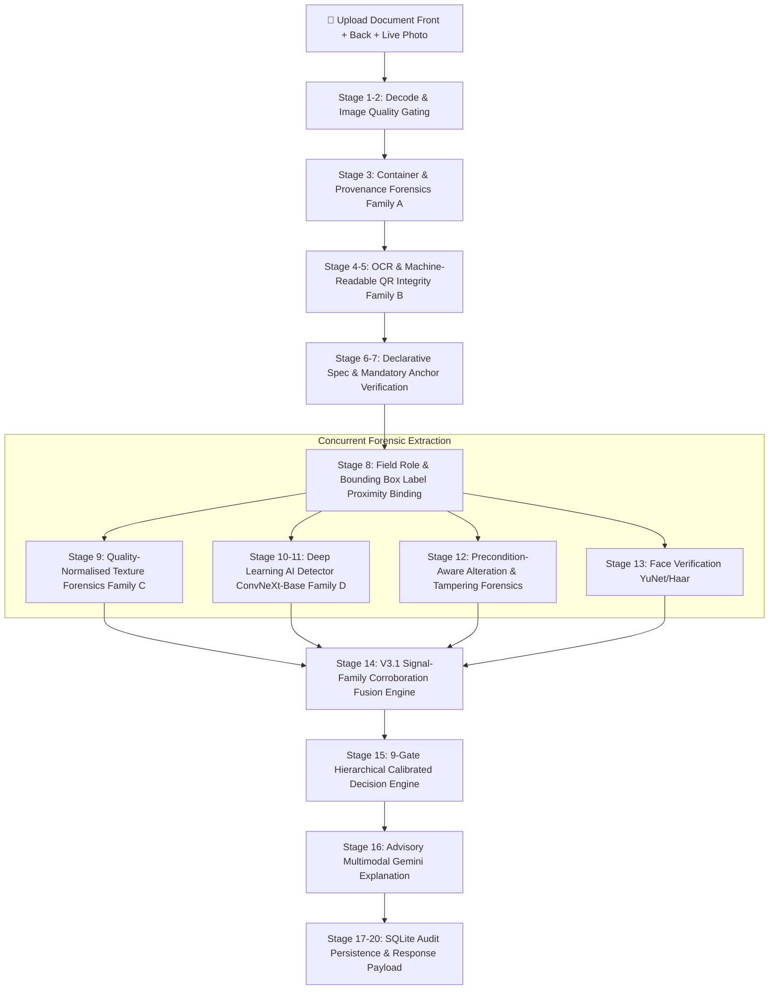

<div align="center">

# 🛡️ SENTINEL V3.3 — Border Identity & Document Screening System

### AI-Powered Real-Time Fake Identity, Digital Tampering & Synthetic Document Detection for Border Security

[](https://fastapi.tiangolo.com)
[](https://react.dev)
[](https://pytorch.org)
[](https://python.org)
[](https://ai.google.dev)
[](https://tailwindcss.com)
[](https://sqlite.org)

*A state-of-the-art border screening platform featuring **Sentinel V3.3 Global Document Coverage Architecture**. Integrates four physically independent evidence families (Container & Provenance, Machine-Readable QR Integrity, Quality-Normalised Texture, and PyTorch ConvNeXt-Base Deep Learning) with universal document specs (`Aadhaar`, `PAN Card`, `Passport`, `Visa`, `Driving License`, `Other`), multi-algorithm check-digit verifiers (Verhoeff, PAN entity code, MRZ TD3/TD1, DL State Code), mandatory printed anchor presence verification, OCR bounding-box label-proximity field resolution, and a fail-closed calibrated decision engine.*

</div>

---

## 📋 Table of Contents

- [System Architecture (V3.1 Signal & Specification Architecture)](#-system-architecture)
- [Step-by-Step 20-Stage Pipeline Workflow](#-step-by-step-20-stage-pipeline-workflow)
- [Declarative Structural Specifications & Mandatory Anchors](#-declarative-structural-specifications--mandatory-anchors)
- [Precondition-Aware Alteration Cues & Tampering Forensics](#-precondition-aware-alteration-cues--tampering-forensics)
- [The 4 Physically Independent Evidence Families](#-the-4-physically-independent-evidence-families)
- [V3.1 Evidence States & 7-Status Decision Engine](#-v31-evidence-states--7-status-decision-engine)
- [Domain Calibration & Model Sanity Pipeline](#-domain-calibration--model-sanity-pipeline)
- [Tech Stack & Dependencies](#-tech-stack)
- [Project Structure](#-project-structure)
- [API Reference (Canonical V3.1 JSON Schema)](#-api-reference)
- [Frontend Components & UI Architecture](#-frontend-components)
- [Database Schema & Persistence](#-database-schema)
- [Automated Test Suite & Verification](#-running-tests--benchmarks)
- [Supported Document Types](#-supported-document-types)

---

## 🏗 System Architecture (V3.1 Signal & Specification Architecture)

```
┌───────────────────────────────────────────────────────────────────────────────────┐
│                          SENTINEL AI — REACT FRONTEND                             │
│                    React 18 + Vite + TailwindCSS + Axios                          │
│                                                                                   │
│   ┌────────────────┐   ┌────────────────────────────┐   ┌──────────────────────┐  │
│   │ Upload Modal   │──▶│ Verification Result Page   │   │ Audit Trail View    │  │
│   │ • Front/Back   │   │ • 7 Decision Status Badges │   │ • Filtering/Search   │  │
│   │ • Live Photo   │   │ • 4 Decoupled Metric Cards │   │ • Paginated History  │  │
│   │ • Progress Bar │   │ • AI Evidence Inspector    │   │ • Record Inspector   │  │
│   └───────┬────────┘   └────────────────────────────┘   └──────────────────────┘  │
│           │ POST /api/documents/verify                                            │
│ └───────────┼───────────────────────────────────────────────────────────────────────┘
            │  HTTP (multipart/form-data)
            ▼
┌───────────────────────────────────────────────────────────────────────────────────┐
│                          SENTINEL AI — FASTAPI BACKEND                            │
│                 FastAPI + Uvicorn + PyTorch + OpenCV + PyZBar + SQLite            │
│                                                                                   │
│   ┌───────────────────────────────────────────────────────────────────────────┐   │
│   │                 20-STAGE CONCURRENT PIPELINE ENGINE                       │   │
│   │                                                                           │   │
│   │  1. Preprocessing ──▶ 2. Quality Gate ──▶ 3. Container & Provenance (A)  │   │
│   │                                                                           │   │
│   │  4. OCR & Line Box Binding ──▶ 5. Machine-Readable QR Integrity (B)      │   │
│   │                                                                           │   │
│   │  6. Declarative Field & Date-Role Resolver (field_resolver.py)            │   │
│   │                                                                           │   │
│   │  7. Mandatory Security Anchor Verifier (anchor_verifier.py)               │   │
│   │        │                                                                   │   │
│   │        ├─▶ 8. Quality-Normalised Texture Forensics (C)                    │   │
│   │        ├─▶ 9. ConvNeXt-Base Deep Learning AI Detector (D)                 │   │
│   │        ├─▶ 10. Precondition-Aware Alteration Forensics (alteration_det)   │   │
│   │        └─▶ 11. OpenCV YuNet Face Verification                            │   │
│   │                                │                                          │   │
│   │  12. V3.1 Signal-Family Corroboration Fusion (A + B + C + D)              │   │
│   │        • Uncalibrated models safely excluded                              │   │
│   │        • Multi-family anchor corroboration rule                           │   │
│   │                                │                                          │   │
│   │  13. Fail-Closed 9-Gate Decision Engine (decision_engine_v31.py)          │   │
│   │        • 7 Statuses: GENUINE | AI_GENERATED | ALTERED | ...               │   │
│   │        • INCOMPLETE_SUBMISSION gate for unsubmitted document sides        │   │
│   │                                │                                          │   │
│   │  14. Advisory Multimodal Gemini Explanation ──▶ 15. SQLite Audit Save     │   │
│   └───────────────────────────────────────────────────────────────────────────┘   │
│                                                                                   │
│   ┌─────────────────┐  ┌───────────────────────────────────────────────────────┐  │
│   │ SQLite Database │  │ ConvNeXt-Base PyTorch (convnext_base_ai_detector_v1)  │  │
│   │  (audit_logs)   │  │ OpenCV YuNet Face DNN (face_detection_yunet_2023mar)  │  │
│   └─────────────────┘  └───────────────────────────────────────────────────────┘  │
└───────────────────────────────────────────────────────────────────────────────────┘
```

---

## 🔄 Step-by-Step 20-Stage Pipeline Workflow

The screening pipeline executes **20 stages** for every uploaded document. Independent forensic modules execute concurrently via Python `asyncio.to_thread` for minimal latency.



### Detailed Breakdown of the 20 Stages

| Stage # | Stage Name | Module / File | Description & Technical Details |
|:---:|---|---|---|
| **1** | File Decode & Size Check | `routers/documents.py` | Reads uploaded `document_file`, `document_back_file`, and `live_capture_file` bytes. Enforces 10MB maximum size limit. |
| **2** | Image Quality Assessment & Gating | `modules/image_quality.py` | Computes Laplacian blur score, contrast, brightness, noise level, and JPEG quality estimate. Gating logic routes severely degraded images to `MANUAL_REVIEW`. |
| **3** | Container & Provenance Forensics | `modules/provenance.py` | **Family A:** Inspects raw bytes for EXIF tags, optical camera capture chains (Make, Model, Lens, Exposure), software generator signatures, ICC profiles, JFIF/MPO structure, and latent dimension alignment. |
| **4** | OCR & Bounding Box Line Extraction | `modules/ocr.py` | Executes RapidOCR / PaddleOCR text line extraction, returning line bounding boxes `(x0, y0, x1, y1)` for geometric label proximity resolution. |
| **5** | Machine-Readable QR Integrity | `modules/qr_integrity.py` | **Family B:** Gated QR code inspection. Verifies Reed-Solomon codeword validity and cross-checks signed QR demographic payload against OCR printed text. Gated on crop Laplacian $\ge 120$ and min crop pixels $\ge 400$. |
| **6** | Aspect Ratio & Layout Warp | `modules/layout_validator.py` | Detects document boundaries, normalizes perspective via 4-point OpenCV warp transform, detects emblem presence, and validates aspect ratio against ISO/IEC 7810 ID-1 standard (~1.586 ratio). |
| **7** | Mandatory Anchor Verification | `modules/anchor_verifier.py` | Performs presence assertions for mandatory printed security artwork (Ashoka emblem, UIDAI logo, govt headers). Uses inset sampling when unwarped to protect anchor core signal from registration drift. |
| **8** | Declarative Field Role Resolution | `modules/field_resolver.py` | Binds dates to semantic roles (`ROLE_DOB` vs `ROLE_ISSUE`) using bounding-box label proximity. Excludes vertical text (left-edge issue dates) from DOB binding. Positionally resolves holder name on unlabelled lines above DOB. |
| **9** | Quality-Normalised Texture Forensics | `modules/texture_forensics.py` | **Family C:** Normalises image width to 1600px, calculates local variance median (5x5 filter), Hanning-windowed radial spectral rolloff, and highpass residual std. Conditions reliability on blur and JPEG blockiness. |
| **10** | Global AI Image Detection | `modules/ai_image_detector.py` | **Family D (Global):** Passes 224×224 RGB image into PyTorch ConvNeXt-Base neural network (~88M parameters) to compute `global_probability`. |
| **11** | Multi-Scale Patch AI Detection | `modules/patch_detector.py` | **Family D (Patch):** Extracts overlapping $224 \times 224$ grid patches and computes patch top-k probability. |
| **12** | Precondition-Aware Alteration Forensics | `modules/alteration_detector.py` | Evaluates 5 alteration cues (`anchor_removal`, `pasted_region_geometry`, `noise_void`, `colour_discontinuity`, `ela`). Probes background flatness to self-disable noise/ELA when scanner app clamps paper white. |
| **13** | Face Verification | `modules/face_match.py` | Compares document portrait against live webcam capture using OpenCV YuNet DNN (`face_detection_yunet_2023mar.onnx`). Sets `score: null` when live capture is omitted. |
| **14** | V3.1 Signal-Family Fusion | `modules/forensic_fusion_v3.py` | Fuses the 4 evidence families (`PROVENANCE`, `SEMANTIC`, `TEXTURE`, `LEARNED`). **Excludes uncalibrated models** (`is_calibrated=False`) from voting and renormalises weights over available families. |
| **15** | V3.1 9-Gate Decision Engine | `modules/decision_engine_v31.py` | Evaluates evidence across 9 hierarchical decision gates, introducing `INCOMPLETE_SUBMISSION` for missing document sides and `ALTERED` for mandatory artwork erasures. |
| **16** | Multimodal Gemini Explanation | `modules/llm_field_validator.py` | Multimodal Gemini API call to generate 1-sentence officer explanation and assist OCR field merging. Operates strictly in **advisory/explanation-only mode**. |
| **17** | Backwards-Compatible Adapter | `modules/forensic_fusion.py` | Translates V3.1 forensic objects into backwards-compatible API schemas and reason code aliases. |
| **18** | Decision Adapter | `modules/decision_engine.py` | Wraps V3.1 decision engine for legacy endpoint compatibility. |
| **19** | Database Audit Persistence | `app/db/schema.py` | Saves full screening JSON, feature vectors, reason codes, and canonical sub-objects into SQLite database (`screening.db`), ensuring non-null fallback constraints. |
| **20** | V3.1 Response Payload Construction | `routers/documents.py` | Returns canonical `VerificationResponse` payload to React SPA frontend. |

---

## 📜 Declarative Structural Specifications & Mandatory Anchors

Sentinel V3.1 introduces a declarative specification engine (`document_spec.py`) that acts as the single source of truth for physical document validity:

1. **Required Sides (`sides_required`)**: Declares which physical sides must be submitted (`FRONT`, `BACK`, `EITHER`). Aadhaar requires both `FRONT` (identity) and `BACK` (address + QR). Submitting only the front triggers `INCOMPLETE_SUBMISSION`.
2. **Mandatory Anchor Artwork (`AnchorSpec`)**: Declares normalised bounding boxes for security artwork (Ashoka Emblem, UIDAI logo, Government brush band, MRZ zone, QR block, portrait).
3. **Semantic Field Roles (`FieldSpec`)**: Defines field key, role (`ROLE_DOB`, `ROLE_ISSUE`, `ROLE_EXPIRY`, `ROLE_NAME`, `ROLE_NUMBER`), required state, label aliases in state scripts (English, Hindi, Gujarati), regex patterns, and age plausibility predicates.
4. **Checksum Validation**: Standardized checksum handlers for Verhoeff (`Aadhaar`), PAN entity character (`PAN Card`), and ICAO 733/9303 MRZ (`Passport`, `Visa`).

---

## 🔍 Precondition-Aware Alteration Cues & Tampering Forensics

Standard Error Level Analysis (ELA) and spatial noise analysis fail when documents are processed via scanner apps (which clamp paper backgrounds to pure `#FFFFFF`) or re-encoded by messaging applications like WhatsApp.

Sentinel V3.1 solves this with **self-disabling cues** and **presence assertions**:

- **Precondition Probing (`_background_flatness`)**: Measures background variance across white pixels. If background flatness exceeds threshold ($\ge 0.50$), `noise_void` and `ela` self-disable (`available: false`) rather than outputting false-reassuring low tampering scores.
- **Mandatory Anchor Presence Assertions**: Measures dark and chromatic ink coverage in declared anchor bounding boxes. Erasing a logo collapses ink coverage to $0.0000$ (vs genuine $\sim 0.1652$), triggering a decisive presence failure score ($0.92$).
- **Targeted Fill Geometry (`pasted_region_geometry`)**: Evaluates only missing anchor regions for straight Hough-line boundaries and uniform fill variance, corroborating *how* mandatory artwork was removed.

---

## 🔬 The 4 Physically Independent Evidence Families

SENTINEL V3.1 structures AI generation and tampering detection across **4 physically independent evidence families**:

| Family | Signals Measured | Survives Recapture? | Fusion Weight | Key Diagnostic Indicators |
|---|---|:---:|:---:|---|
| **A. PROVENANCE** | Container format, EXIF optical parameters, camera identity, JPEG quantization, ICC/XMP, software signatures | ✅ **Yes** | **0.35** | `OPTICAL_CAPTURE_CHAIN_PRESENT`, `CONTAINER_NOT_CAMERA_NATIVE`, `GENERATOR_SOFTWARE_TAG`, `LATENT_ALIGNED_DIMENSIONS` |
| **B. SEMANTIC** | Machine-readable QR codeword validity, Reed-Solomon error correction, QR payload vs printed OCR cross-check | ✅ **Yes** | **0.35** | `MACHINE_READABLE_PAYLOAD_DECODED`, `QR_PAYLOAD_MATCHES_PRINTED_FIELDS`, `QR_PAYLOAD_CONTRADICTS_PRINTED_NUMBER`, `QR_STRUCTURE_PRESENT_BUT_NO_VALID_CODEWORD` |
| **C. TEXTURE** | 1600px normalised local variance median (5x5), Hanning-windowed radial spectrum flatness, highpass residual std | ⚠️ *Degrades* | **0.20** | `SURFACE_MICROTEXTURE_UNNATURALLY_SMOOTH`, `HIGH_FREQUENCY_ENERGY_DEFICIT`, `FLAT_SPECTRAL_TAIL_CONSISTENT_WITH_UPSAMPLER` |
| **D. LEARNED** | PyTorch ConvNeXt-Base global probability + multi-scale patch grid top-k probability | ⚠️ *Degrades* | **0.10** | `AI_MODEL_CALIBRATED` (Strictly **EXCLUDED** when `is_calibrated=False` so dead/uncalibrated classifier heads do not drag decisions to 0.55) |

---

## ⚖️ V3.1 Evidence States & 7-Status Decision Engine

The V3.1 decision engine (`modules/decision_engine_v31.py`) evaluates incoming screening evidence through **9 hierarchical decision gates** (first match wins):

```
Gate 1: Watchlist Blacklist Match ─────────▶ SUSPICIOUS (0.99)
Gate 2: Corroborated Alteration ────────────▶ ALTERED / AI_GENERATED_AND_ALTERED (0.90+)
Gate 3: Structural Invalidity ──────────────▶ SUSPICIOUS (1.0 - dv)
Gate 4: Incomplete Submission ──────────────▶ INCOMPLETE_SUBMISSION (0.0)
Gate 5: Required-Field Gaps / Role Conflict▶ MANUAL_REVIEW (0.35)
Gate 6: Capture Quality Floor ──────────────▶ MANUAL_REVIEW (0.30)
Gate 7: Corroborated AI Synthesis ─────────▶ AI_GENERATED (0.90+)
Gate 8: Forensic Contradiction ─────────────▶ MANUAL_REVIEW (0.40)
Gate 9: Positive Clearance (Route A/B) ─────▶ GENUINE (0.85 - 0.98)
Fallback ───────────────────────────────────▶ MANUAL_REVIEW
```

### 7 Operational Statuses

| Status Code | Badge UI Styling | Operational Definition & Criteria |
|---|---|---|
| **`GENUINE`** | Emerald Green (`#059669`) | High structural validity ($\ge 0.85$), low tampering ($< 0.50$), low AI ($\le 0.35$), clearing Route A or Route B. |
| **`AI_GENERATED`** | Purple / Violet (`#7c3aed`) | Strong corroborated AI evidence ($\ge 2$ families, anchor present, fused AI prob $\ge 0.65$). |
| **`ALTERED`** | Amber / Orange (`#d97706`) | Corroborated digital edit tampering or erased mandatory security artwork anchors. |
| **`AI_GENERATED_AND_ALTERED`** | Crimson / Rose (`#e11d48`) | **Both** strong corroborated AI generation ($\ge 0.65$) **and** high digital edit tampering / anchor removal ($\ge 0.75$). |
| **`SUSPICIOUS`** | Red (`#dc2626`) | Critical structural invalidity (failed document number pattern, bad checksum, expired passport, invalid layout) or **Blacklist Watchlist Match**. |
| **`MANUAL_REVIEW`** | Yellow / Slate (`#ca8a04`) | Missing required fields, unread holder name, role conflict, degraded image quality (`quality_score < 0.45`), or contradictory evidence. Reports explicit `blocking_gaps`. |
| **`INCOMPLETE_SUBMISSION`** | Blue (`#2563eb`) | Physical document presentation gap (e.g. front-only upload of Aadhaar missing the back side). Deliberately distinct from forgery or manual review. |

---

## 🧪 Domain Calibration & Model Sanity Pipeline

The `ml/calibrate_v3.py` script performs model sanity checks and fits domain texture thresholds:

```bash
cd backend

# Run V3 Model Sanity & Threshold Calibration
python ml/calibrate_v3.py --real dataset/id_domain/real \
                          --synth dataset/id_domain/ai_generated \
                          --model app/models/convnext_base_ai_detector_v1.pth \
                          --out app/models/thresholds_v3.json
```

---

## 💻 Tech Stack

- **Backend Framework:** FastAPI (Async Python 3.14 / 3.12)
- **Deep Learning & Computer Vision:** PyTorch 2.5+, torchvision (`ConvNeXt-Base` ~88M parameters), OpenCV 4.10+ (`cv2.FaceDetectorYN` YuNet DNN), NumPy, Pillow, scikit-image
- **Barcode & QR Decoding:** `pyzbar` + `libzbar0` (Reed-Solomon codeword verification)
- **OCR Engines:** RapidOCR / PaddleOCR, PyTesseract, `mrz` (ICAO 9303 parser)
- **Multimodal AI Integration:** Google Gemini AI API (`google-genai` SDK)
- **Database & ORM:** SQLite 3 + SQLAlchemy 2.0
- **Frontend Framework:** React 18 SPA + Vite 5 + TailwindCSS 3 + Axios + Lucide Icons
- **Test Runner & Benchmarks:** pytest 9.1+ + custom verification suite

---

## 📁 Project Structure

```
SIH/
├── files (1)/                         # V3.1 Fix Plan & Updated Modules
│   ├── FIX_PLAN_V31.md                # V3.1 Root cause analysis & fix specification
│   ├── document_spec.py               # V3.1 Declarative document structure spec
│   ├── anchor_verifier.py             # V3.1 Mandatory anchor presence verifier
│   ├── alteration_detector.py         # V3.1 Precondition-aware alteration detector
│   ├── field_resolver.py              # V3.1 Bounding box proximity field resolver
│   ├── decision_engine_v31.py         # V3.1 9-gate decision engine with INCOMPLETE_SUBMISSION
│   └── verify_aadhaar_case.py         # Aadhaar edge case verification test
├── backend/
│   ├── app/
│   │   ├── config.py                  # Environment settings & thresholds
│   │   ├── main.py                    # FastAPI app, lifespan, DB auto-migration
│   │   ├── db/
│   │   │   ├── database.py            # SQLAlchemy engine & session maker
│   │   │   └── schema.py              # AuditLog DB schema (V3.1 fields & JSON columns)
│   │   ├── models/
│   │   │   ├── convnext_base_ai_detector_v1.pth # ConvNeXt-Base PyTorch model weights (~350MB)
│   │   │   ├── face_detection_yunet_2023mar.onnx # OpenCV YuNet ONNX face detector
│   │   │   └── thresholds_v3.json     # Dynamic V3 threshold configuration
│   │   ├── modules/
│   │   │   ├── document_spec.py       # [V3.1] Declarative document specs
│   │   │   ├── anchor_verifier.py     # [V3.1] Mandatory security anchor presence verifier
│   │   │   ├── alteration_detector.py # [V3.1] Precondition-aware alteration detector
│   │   │   ├── field_resolver.py      # [V3.1] Bounding box proximity & date/name resolver
│   │   │   ├── decision_engine_v31.py # [V3.1] 9-Gate Calibrated Decision Engine
│   │   │   ├── provenance.py          # [V3] Stage 3b: Container & Provenance Forensics
│   │   │   ├── qr_integrity.py        # [V3] Stage 5b: Machine-Readable QR Integrity
│   │   │   ├── texture_forensics.py   # [V3] Stage 9: Quality-Normalised Texture Forensics
│   │   │   ├── forensic_fusion_v3.py  # [V3] Stage 14: Signal-Family Corroboration Fusion
│   │   │   ├── decision_engine_v3.py  # [V3] 3-State Calibrated Decision Engine
│   │   │   ├── forensic_fusion.py     # Backwards-compatibility fusion adapter
│   │   │   ├── decision_engine.py    # Backwards-compatibility decision adapter
│   │   │   ├── ai_image_detector.py   # Global ConvNeXt-Base binary detector service (~88M params)
│   │   │   ├── patch_detector.py      # Multi-scale 224x224 grid patch inference
│   │   │   ├── tampering_detector.py  # V3.1-enhanced tampering detector
│   │   │   ├── image_quality.py       # Image quality assessment & gating engine
│   │   │   ├── validation.py          # Document structural validity & rules engine
│   │   │   ├── face_match.py          # OpenCV YuNet face match & null handler
│   │   │   ├── ocr.py                 # RapidOCR / PaddleOCR text line extractor
│   │   │   ├── layout_validator.py    # Perspective warp & aspect ratio check
│   │   │   ├── llm_field_validator.py # Multimodal Gemini advisory analyzer
│   │   │   └── preprocessing.py       # Auto-orient & image normalizer
│   │   ├── routers/
│   │   │   ├── documents.py           # 20-stage POST /api/documents/verify router
│   │   │   └── audit.py               # Paginated GET /api/audit router
│   │   └── schemas/
│   │       ├── document.py            # Canonical VerificationResponse Pydantic schema
│   │       └── decision.py            # Final decision payload schema (supports INCOMPLETE_SUBMISSION)
│   ├── ml/
│   │   ├── calibrate_v3.py            # Model sanity check & calibration script
│   │   ├── prepare_dataset.py         # Dataset preparation pipeline
│   │   └── train_ai_detector.py       # ConvNeXt-Base binary detector training script
│   └── tests/
│       ├── test_v31_edge_cases.py     # [V3.1] Edge-case test suite
│       ├── test_v2_architecture.py    # V2/V3 target architecture test suite
│       ├── test_security_v2.py        # Security fail-closed test suite
│       ├── test_decision_engine.py    # Decision engine test suite
│       └── ...                        # 100 total unit tests (100% pass rate)
├── Frontend/
│   └── src/                           # React 18 SPA Frontend
└── README.md                          # Main Project Documentation
```

---

## 🔌 API Reference (Canonical V3.1 JSON Schema)

### Endpoint: `POST /api/documents/verify`

**Request:** `multipart/form-data`
- `document_file` (File, Required): Front-side document image (max 10MB)
- `document_back_file` (File, Optional): Back-side document image (max 10MB)
- `live_capture_file` (File, Optional): Live photo for face verification
- `document_type` (String, Required): `Passport`, `Visa`, `Aadhaar`, `PAN Card`, `Driving License`, `Other`

**Canonical Response Payload (`200 OK`):**

```json
{
  "id": 208,
  "created_at": "2026-09-15T10:48:30Z",
  "document_type": "Aadhaar",
  "filename": "aadhaar_front.jpg",
  "decision": {
    "status": "INCOMPLETE_SUBMISSION",
    "evidence_state": "INSUFFICIENT",
    "confidence": 0.0,
    "decision_confidence": 0.0,
    "requires_manual_review": true,
    "reason_codes": [
      "INCOMPLETE_SUBMISSION_MISSING_SIDE",
      "SIDE_NOT_PROVIDED_BACK"
    ],
    "officer_action": "Document not fully presented. Capture the back side and resubmit. No verdict is admissible until then.",
    "blocking_gaps": [
      "UPLOAD_BACK_SIDE"
    ]
  },
  "document_validity": {
    "score": 0.70,
    "ocr_confidence": 0.92,
    "layout_score": 0.85,
    "checksum_valid": true,
    "expiry_valid": true,
    "required_fields_present": true,
    "structural_validity": false,
    "failed_rules": []
  },
  "ai_analysis": {
    "status": "LOW_AI_EVIDENCE",
    "probability": 0.05,
    "ai_probability": 0.05,
    "global_probability": 0.05,
    "patch_topk_probability": 0.05,
    "frequency_anomaly": 0.0,
    "noise_anomaly": 0.0,
    "strong_signal_count": 0,
    "strong_signals": [],
    "corroborated": false,
    "model_loaded": true,
    "is_weights_loaded": true,
    "trained": true,
    "calibrated": false,
    "model_version": "convnext_base_ai_detector_v1",
    "reasons": []
  },
  "tampering_analysis": {
    "probability": 0.0,
    "tampering_probability": 0.0,
    "ela_score": 0.0,
    "noise_inconsistency": 0.0,
    "copy_move_score": 0.0,
    "splicing_score": 0.0,
    "metadata_score": 0.0,
    "confidence": 0.50,
    "flags": []
  },
  "image_quality": {
    "score": 0.85,
    "blur_score": 150.0,
    "resolution_ok": true,
    "brightness_ok": true,
    "contrast_score": 55.0,
    "saturation_score": 20.0,
    "jpeg_quality_estimate": 85.0,
    "noise_level": 3.5,
    "warnings": [],
    "quality_warning": false,
    "quality_too_low_for_forensics": false
  },
  "face_verification": {
    "available": false,
    "score": null,
    "status": "NOT_PROVIDED"
  },
  "fusion": {
    "model_ready": true,
    "strong_signal_count": 0,
    "strong_signals": [],
    "corroborated": false,
    "ai_evidence": 0.05,
    "tampering_evidence": 0.0,
    "genuine_evidence": 0.85
  },
  "gemini": {
    "available": true,
    "role": "EXPLANATION_ONLY",
    "summary": "Front side identity fields extracted. Upload back side to complete screening."
  },
  "model_versions": {
    "ai_detector": "convnext_base_ai_detector_v1",
    "tampering_detector": "tampering_v2",
    "fusion": "fusion_v3",
    "decision_engine": "decision_engine_v31"
  },
  "risk_score": 35,
  "prediction": "INCOMPLETE_SUBMISSION",
  "probability": 0.05
}
```

---

## 🎨 Frontend Components & UI Architecture

| Component | File Path | Key UI Responsibilities |
|---|---|---|
| **`ResultPage.jsx`** | `src/pages/ResultPage.jsx` | Main verification dashboard displaying **4 distinct metric cards** (*Document Validity*, *AI Evidence Probability*, *Digital Tampering*, *Image Quality Score*). |
| **`RiskScoreBadge.jsx`** | `src/components/RiskScoreBadge.jsx` | Circular gauge SVG + **7 distinct status badges** (`GENUINE`, `AI_GENERATED`, `ALTERED`, `AI_GENERATED_AND_ALTERED`, `SUSPICIOUS`, `MANUAL_REVIEW`, `INCOMPLETE_SUBMISSION`). |
| **`AiImageAnalysisCard.jsx`** | `src/components/AiImageAnalysisCard.jsx` | AI forensic inspection card showing global probability, patch top-k score, texture metrics, and expandable **AI Evidence Inspector** modal. |
| **`ForensicCard.jsx`** | `src/components/ForensicCard.jsx` | Digital tampering card showing ELA score, copy-move duplication, splicing edge anomalies, missing security anchors, and EXIF software tags. |
| **`EvidenceTimeline.jsx`** | `src/components/EvidenceTimeline.jsx` | Interactive 20-stage pipeline execution stepper modal showing module timing and model versions. |
| **`PipelineProgressModal.jsx`** | `src/components/PipelineProgressModal.jsx` | Real-time scanner modal with SVG blueprint animation and streaming log console during upload. |

---

## 🗄 Database Schema & Persistence

**SQLite File:** `backend/screening.db`  
**Table:** `audit_logs` (stores canonical V3.1 full forensic JSON, feature vectors, decision reason codes, and non-null fallback safeguards).

---

## 🧪 Automated Test Suite & Verification

### Automated Unit Test Suite (`pytest`)
Executes **100 unit tests** covering all V3.1 forensic signal families, declarative document specs, mandatory anchor presence verification, field role binding, decision engine gating, quality gating, and FastAPI endpoints:

```bash
cd backend
python -m pytest tests/ -v
```

**Output:**
```text
===================== 100 passed, 809 warnings in 23.99s ======================
```

---

## 📜 Supported Document Types

| Document Type | Sides Required | Mandatory Anchors | Checksum Algorithm | MRZ Specification | Machine-Readable QR Check |
|---|:---:|---|---|---|:---:|
| 🛂 **Passport** | `FRONT` | Header, Coat of Arms, MRZ zone, Portrait | ICAO 9303 check digits | ✅ TD3 (2-line, 44-char) | ❌ Optional |
| 🎫 **Visa** | `FRONT` | VISA Header, Coat of Arms, MRZ zone | ICAO 9303 check digits | ✅ TD1 (3-line, 30-char) | ❌ Optional |
| 🆔 **Aadhaar** | `FRONT` + `BACK` | Ashoka Emblem, Saffron/Green Band, UIDAI Logo, Portrait, Number Band, Red Slogan Rule | **Verhoeff Algorithm** | ❌ N/A | ✅ **Mandatory QR (Back)** |
| 💳 **PAN Card** | `FRONT` | Ashoka Emblem, Income Tax Header, Govt Header, QR Block, Portrait | 4th char entity check (P/C/H/F/A/T) | ❌ N/A | ✅ **Mandatory QR (Front)** |
| 🚗 **Driving License** | `FRONT` | State Transport Dept Header, Portrait | State code + length check | ❌ N/A | ❌ Optional |
| 📄 **Other** | `FRONT` | Generic required fields | Basic regex check | ❌ N/A | ❌ Optional |

---

<div align="center">

**Built for Smart India Hackathon (SIH)**

*SENTINEL V3.3 — Protecting borders through intelligent multi-family document screening*

</div>
